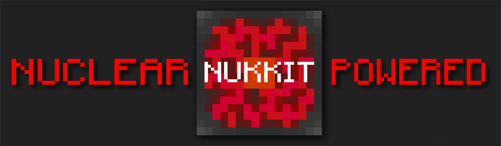

[](LICENSE)
[](https://circleci.com/gh/nukkitv/Nukkit/tree/master)


ATTENTION
-------------
* Changes in the temporary repo can be merged to this repo when they are stable
* The temporary repo is located [here](https://github.com/wode490390/Nukkit/tree/f181030e)

Introduction
-------------

Nukkit is nuclear-powered server software for Minecraft: Pocket Edition.
It has a few key advantages over other server software:

* Written in Java, Nukkit is faster and more stable.
* Having a friendly structure, it's easy to contribute to Nukkit's development and rewrite plugins from other platforms into Nukkit plugins.

Nukkit is **under improvement** yet, we welcome contributions. 

Get Nukkit
--------------------

* __[Download](https://circleci.com/gh/nukkitv/Nukkit/tree/master)__

Build JAR file
-------------
- `git submodule update --init`
- `mvn clean package`

The compiled JAR can be found in the `target/` directory.

Running
-------------
Simply run `java -jar nukkit-1.0-SNAPSHOT.jar`.

Plugin API
-------------
#### **Example Plugin**
Example Plugin which shows the API of Nukkit.

* __[Example Plugin](http://github.com/nukkitv/ExamplePlugin)__

Docker
-------------

Running Nukkit in [Docker](https://www.docker.com/) (17.05+ or higher).

Build image from source,

```
docker build -t nukkit .
```

Run once to generate the `/data` volume, default settings, and choose language,

```
docker run -it --rm -p 19132:19132 nukkit
```

Use [docker-compose](https://docs.docker.com/compose/overview/) to start server on port `19132` and with `./data` volume,

```
docker-compose up -d
```

Contributing
------------
Please read the [CONTRIBUTING](.github/CONTRIBUTING.md) guide before submitting any issue. Issues with insufficient information or in the wrong format will be closed and will not be reviewed.
